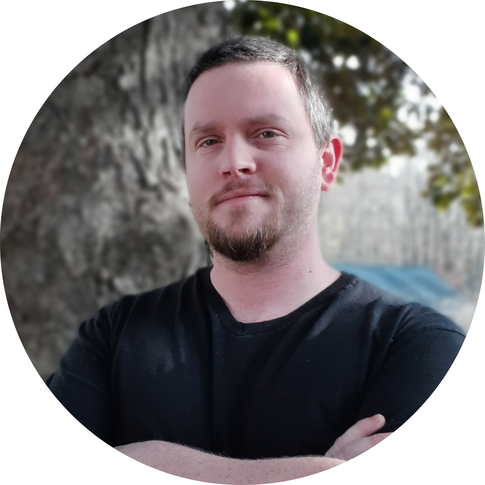

---
hide:
  - navigation
  - toc
---

{: align=left class=headshot }

!!! success inline end "I'm looking for new opportunities"
    You can view my resume [here](/static/resume.pdf){: target=_blank }.

Hi, I’m Stephen Collins—a veteran software developer with three decades of experience, currently serving as Technical Lead at [Ostrich](https://getostrich.com){: target=_blank } (on a part-time basis). I'm actively seeking new opportunities where I can bring deep technical expertise, long-term thinking, and genuine care to the craft of software development.

I’m not just a coder. I’m a builder—of tools, of systems, and experiences. I’ve spent my life refining not just how to write code, but how to write it well. I don’t ship and forget. I shape systems that grow, evolve, and last.

Over the past ten years in professional roles, I’ve led projects, mentored devs, and built platforms from the ground up. What sets me apart isn’t raw talent—it’s devotion. I care deeply about user experience. I think about the developer who’ll touch my code years from now. I question the impact of every architectural decision. And I believe craftsmanship matters just as much as velocity.

I'm not a cog. I’m not a code monkey. I’m the kind of teammate who asks, “what’s the right way to do this?”—even if it's harder. Especially if it’s harder.

If you're looking for someone who sees software as more than syntax, feel free to reach out at sgcollins@outlook.com.

You can also get a better sense of how I approach my work from my appearance on the Silicon Alley Podcast:
<iframe src="https://anchor.fm/silicon-alley/embed/episodes/The-Human-Side-of-Software--Stephen-Collins--Founder-of-Double-Precision-Software-enmbh3" height="102px" width="400px" frameborder="0" scrolling="no"></iframe>

When inspiration strikes, I also write [essays](https://nibblesnbits.medium.com){: target=_blank } and [fiction](https://nibblesnbits.github.io/my-portfolio/){: target=_blank }.
